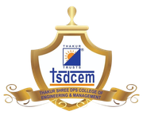

<div align="center">



# 🏆 Internal Hackathon 2026 — Portal

**Thakur Shree DPS College of Engineering and Management**

*A dark-themed, single-page portal built for the Smart India Hackathon **Internal Team Selection Round***


<br>

[](https://tsdcem-internal-hackathon.vercel.app)

[](https://react.dev/)
[](https://www.typescriptlang.org/)
[](https://vitejs.dev/)
[](https://threejs.org/)
[](https://tsdcem-internal-hackathon.vercel.app)

---

</div>

## ✨ Highlights

> A glassmorphism hero with a neon scanner sweep, a real-time fluid-gradient WebGL backdrop, and a fully browsable grid of official SIH problem statements — all in one immersive page.

| | |
| --- | --- |
| 🎬 **Cinematic Loading Screen** | Minimal progress-ring animation on first load |
| 🌊 **Fluid Gradient Engine** | Real-time WebGL fluid backdrop enhanced with simplex noise |
| 🧊 **Liquid Glass Hero** | True refractive glass via SVG `feDisplacementMap` + backdrop blur |
| ⚡ **Neon Scan Text Effect** | Glowing scanner bar sweeps across the headline; respects `prefers-reduced-motion` |
| 🧩 **Problem Statements Grid** | Animated, keyboard-accessible cards with difficulty badges & detail dialogs |
| 🏛️ **Official Branding** | TSDCEM crest + MoE / AICTE / Innovation Cell / SIH 2026 logo strip |
| 📜 **Scroll Interactions** | Hero parallax & fade, logo fade-out on scroll |

## 🛠 Tech Stack

| Layer | Technology |
| --- | --- |
| 🖥 UI | **React 19** + **TypeScript** |
| ⚙️ Build | **Vite 8** |
| 🎨 Graphics | **Three.js**, **simplex-noise** |
| 💅 Styling | Hand-written CSS — custom utilities & component styles |

## 🚀 Getting Started

```bash
# 1️⃣ install dependencies
npm install

# 2️⃣ start the dev server
npm run dev

# 3️⃣ production build (outputs to dist/)
npm run build
```

> **Prerequisites:** Node.js ≥ 18 · npm ≥ 9

## 📂 Project Structure

```
├── index.html                  # App entry point
├── public/
│   ├── tsdcem.png              # College crest
│   └── sih_logo.png            # MoE | AICTE | Innovation Cell | SIH 2026 strip
└── src/
    ├── main.tsx                # React root
    ├── App.tsx                 # Layout: background, logos, hero, grid
    ├── index.css               # Global styles & utility classes
    ├── data/
    │   └── problemStatements.ts
    └── components/
        ├── LoadingScreen.tsx           # Initial progress-ring loader
        ├── FluidGradientEngine.tsx     # Real-time WebGL fluid backdrop
        ├── LiquidGlass.tsx             # Reusable SVG-displacement glass card
        ├── IntroHero.tsx               # Hero banner + scan text effect
        └── ProblemStatementsGrid.tsx   # Cards grid + detail dialog
```

## 🧠 Component Overview

| Component | Purpose |
| --- | --- |
| `LoadingScreen` | Full-screen loader with a thin progress ring shown for the first ~2.7 s |
| `FluidGradientEngine` | Fixed WebGL canvas rendering the animated fluid gradient behind all content |
| `LiquidGlass` | Generic wrapper providing refraction/backdrop-blur glass styling via CSS variables & SVG filters |
| `IntroHero` | College name, **Internal Hackathon 2026** headline with scan effect, scroll-linked fade |
| `ProblemStatementsGrid` | Filterable problem statements; click/Enter opens a dialog with description, expected prototype & evaluation focus |

## ♿ Accessibility

- ✅ Problem-statement cards are focusable with `role="button"` and Enter/Space support
- ✅ Dialog closes on `Escape` and locks body scroll while open
- ✅ Scan-text animation is disabled under `prefers-reduced-motion`
- ✅ Responsive layout for desktop, tablet & mobile

---

<div align="center">

**[🌐 View Live →](https://tsdcem-internal-hackathon.vercel.app)**

Made with 💙 by the Web Dev Team @ **TSDCEM**

ISC © Thakur Shree DPS College of Engineering and Management

</div>
